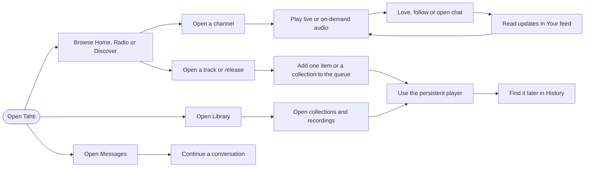
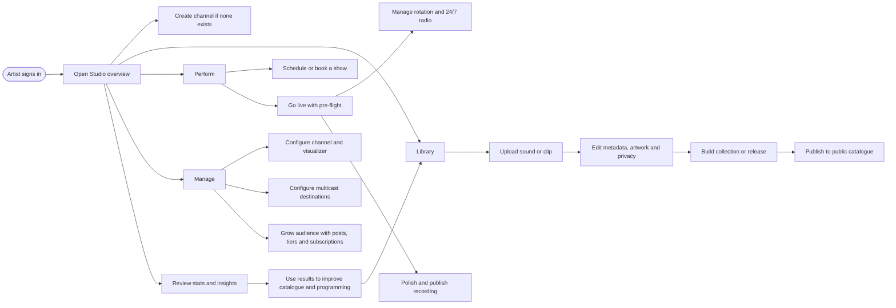
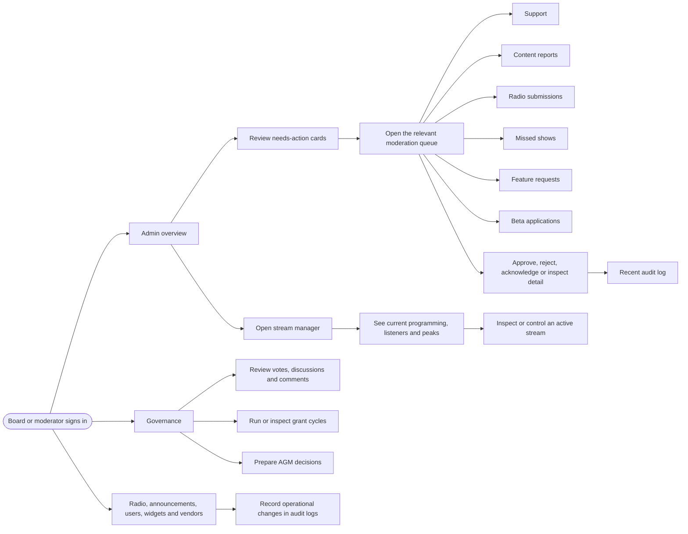

# Tahti sitemap and user journeys

This page is the route-level map for the Tahti client. It shows the shared listener shell, the artist Studio workspace, and the governing-person administration surface. The governing role means a board or moderator account with the permissions needed for the relevant queue; ordinary listeners and artists do not receive those controls.

## Sitemap

```mermaid
flowchart TD
  Root[Tahti]
  Root --> Listen[Listen]
  Root --> Library[Library]
  Root --> Artist[Artist channel]
  Root --> Studio[Studio]
  Root --> Settings[Settings]
  Root --> Community[Community]
  Root --> Help[Help and public information]

  Listen --> Home[Home]
  Listen --> Radio[Radio]
  Listen --> Discover[Discover]
  Listen --> Feed[Your feed]
  Listen --> Messages[Messages]
  Listen --> Chat[Channel chat]

  Library --> Sounds[All sounds]
  Library --> Collections[Collections]
  Library --> Recordings[Recordings]
  Library --> History[History]
  Library --> Favourites[Favourites]
  Library --> Smartlinks[Smartlinks]

  Artist --> Profile[Public profile]
  Artist --> PublicContent[Public sounds and releases]
  Artist --> Subscribe[Subscribe and audience]
  Artist --> ArtistChat[Artist chat]

  Studio --> StudioHome[Overview]
  Studio --> StudioLibrary[Library]
  Studio --> Perform[Perform]
  Studio --> Manage[Manage]
  StudioLibrary --> StudioSounds[Sounds]
  StudioLibrary --> StudioCollections[Collections and playlists]
  StudioLibrary --> StudioRecordings[Recordings]
  StudioLibrary --> Upload[Upload]
  StudioLibrary --> Editor[Audio editor]
  StudioLibrary --> Stash[Stash]
  Perform --> GoLive[Go live and pre-flight]
  Perform --> Schedule[Schedule and analytics]
  Perform --> Events[Events and venues]
  Perform --> Shows[Shows and episodes]
  Manage --> Channel[Channel]
  Manage --> RadioManage[Radio and 24/7]
  Manage --> GreenRoom[Green room]
  Manage --> Multicast[Multicast]
  Manage --> Selects[Tahti Selects]
  Manage --> Moderation[Channel moderation]
  Manage --> Governance[Artist governance]

  Settings --> Account[Account and security]
  Settings --> ArtistSettings[Artist identity and branding]
  Settings --> ChannelSettings[Channel and discovery]
  Settings --> Audience[Audience and tiers]
  Settings --> Addons[Add-ons]
  Settings --> Themes[Themes and visualizers]

  Community --> PublicGovernance[Governance proposals]
  Community --> PublicHelp[Help center]
  Help --> Status[Platform status]
  Help --> About[About and legal pages]

  Admin[Governance person] --> AdminOverview[Admin overview]
  Admin --> AdminModeration[Moderation queues]
  Admin --> AdminLogs[Logs and recent audit]
  Admin --> AdminStreams[Stream manager]
  Admin --> AdminUsers[Users and roles]
  Admin --> AdminRadio[Radio and announcements]
  Admin --> AdminGovernance[Governance, grants and AGM]
  Admin --> AdminWidgets[Widget catalogue]
  Admin --> AdminOps[Storage, vendors and localization]
```

The top-level shell stays available while moving between listener, artist, settings, chat, messages, notifications, and history. Studio and Admin add a contextual left menu; the current top section determines which submenu is visible.

## Listener journey

A listener can discover public content, play tracks and live channels, queue individual items or whole collections, love and follow artists, join channel chat, read the feed, revisit history, and message other users. Signed-out users can browse public content but do not see the personalized feed or private account surfaces.

## Artist journey

An artist creates or configures a channel, uploads and edits content, organizes it into collections or releases, then publishes it. The same Studio workspace supports schedule planning, live pre-flight, rotation programming, recordings, channel design, multicast, audience tools, posts, governance input, and performance insights.

## Governing-person journey

A governing person starts from the Admin overview, processes actionable queues, records decisions in the audit trail, monitors streams, and maintains the platform’s governance and operational systems. Administrative routes are permission-gated; a direct URL does not grant board access.

## Journey boundaries

| Role | Can do | Cannot do without a higher role |
| --- | --- | --- |
| Listener | Browse, play, queue, love, follow, chat, message, manage personal account | Edit artist catalogue, control streams, moderate users, govern platform decisions |
| Artist | Everything a listener can do plus publish, broadcast, schedule, configure a channel, manage audience and review own insights | Review board-only queues, manage other users, operate platform-wide governance |
| Governing person | Board/moderator operations, moderation decisions, stream oversight, governance administration | Edit another artist’s private content unless the relevant administrative permission explicitly allows it |

For implementation parity, use the client router and the sibling Tahti API routes as the source of truth. A new journey is complete only when its route, API counterpart, permission check, loading state, empty state, error state, and audit behavior are all represented.
