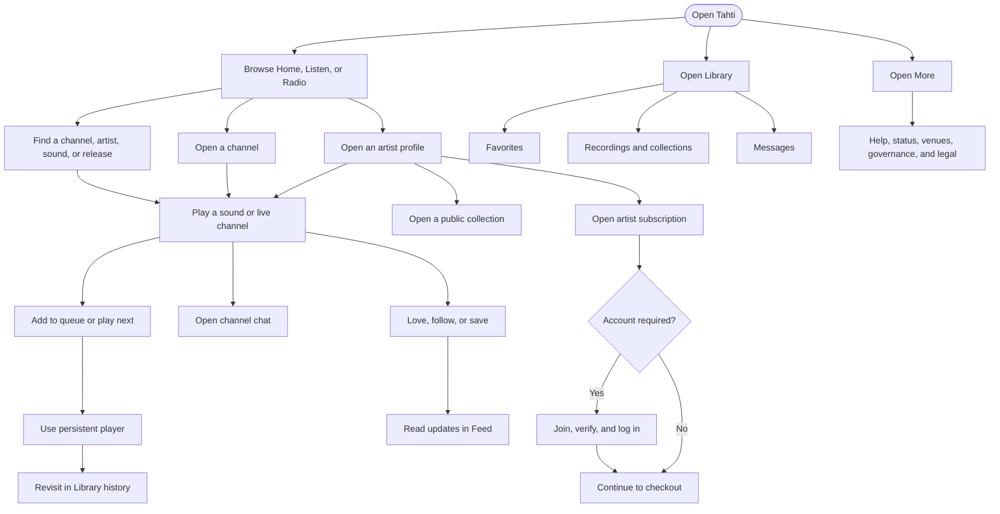
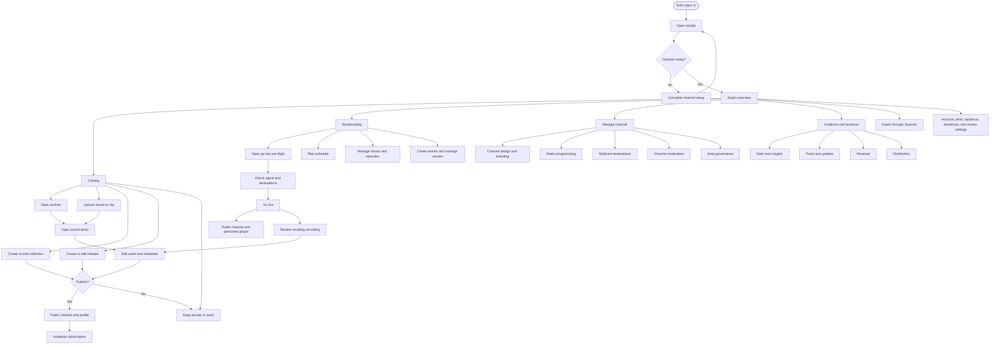

# Tahti sitemap and user journeys

This page maps the current Tahti client by role. Listener routes are public or account-gated, Artist routes are the Studio workspace, and Admin routes are permission-gated operations. A direct URL never grants a role.

## Shared sitemap

```mermaid
flowchart TD
  Root[Tahti] --> Listen[Listen]
  Root --> Library[Library]
  Root --> Artist[Public artist surface]
  Root --> Studio[Studio]
  Root --> Settings[Settings]
  Root --> More[More and sources]
  Root --> Community[Community and information]
  Root --> Admin[Admin]

  Listen --> Home[Home]
  Listen --> Radio[Radio]
  Listen --> Feed[Feed]
  Listen --> Channel[Channel]
  Listen --> Profile[Artist profile]
  Listen --> Chat[Chat]

  Library --> Sounds[Sounds]
  Library --> Releases[Releases]
  Library --> Collections[Collections]
  Library --> Recordings[Recordings]
  Library --> Favorites[Favorites]
  Library --> History[History]
  Library --> Smartlinks[Smart links]
  Library --> Messages[Messages]

  Artist --> PublicSounds[Public sounds and releases]
  Artist --> Subscribe[Subscribe]
  Artist --> ArtistCollections[Public collections]

  Studio --> StudioHome[Overview]
  Studio --> Catalog[Catalog and editing]
  Studio --> Broadcast[Broadcasting]
  Studio --> ChannelManage[Channel management]
  Studio --> Audience[Audience and business]
  Catalog --> Archive[Archive]
  Catalog --> Upload[Upload]
  Catalog --> Editor[Editor]
  Catalog --> StudioCollections[Collections]
  Catalog --> StudioReleases[Releases]
  Catalog --> Stash[Stash]
  Broadcast --> GoLive[Go live]
  Broadcast --> Schedule[Schedule]
  Broadcast --> Shows[Shows]
  Broadcast --> Events[Events]
  ChannelManage --> Design[Channel and branding]
  ChannelManage --> RadioManage[Radio]
  ChannelManage --> Multicast[Multicast]
  ChannelManage --> Moderation[Moderation]
  Audience --> Stats[Stats and insights]
  Audience --> Updates[Updates]
  Audience --> Revenue[Revenue]
  Audience --> Distribution[Distribution]

  More --> Sources[Sources and imports]
  More --> Themes[Themes]
  Community --> Governance[Governance]
  Community --> Venues[Venues]
  Community --> Help[Help, status, and legal]

  Admin --> AdminOverview[Overview and activity]
  Admin --> AdminModeration[Moderation queues]
  Admin --> AdminOperations[Platform operations]
  Admin --> AdminGovernance[Governance and funding]
```

The persistent player, queue, chat rail, notifications, and account controls can be reached from the shared shell while a user moves between these sections.

## Listener journey

Listeners can browse public content without an account. Signing in unlocks personal library, history, favorites, feed, messages, and account settings; membership or artist-specific permissions unlock additional subscription and governance actions.

## Artist journey

The Studio workspace is route-based. Its main work is catalog publishing, live broadcasting, channel management, and audience operations; Sources, Settings, and the public channel are supporting surfaces for those flows.

## Admin journey

```mermaid
flowchart TD
  Admin([Admin or moderator signs in]) --> Overview[Open /admin]
  Overview --> Activity[Open activity and logs]
  Activity --> Audit[Review audit log]
  Overview --> Triage[Review overview and needs-action cards]
  Triage --> Moderation[Open moderation]
  Moderation --> Reports[Content reports]
  Moderation --> Support[Support tickets]
  Moderation --> RadioSubmissions[Radio submissions]
  Moderation --> StationSuggestions[Radio station suggestions]
  Moderation --> FeatureRequests[Feature requests]
  Moderation --> Beta[Beta applications]
  Moderation --> MissedShows[Missed shows]
  Reports --> Decision[Inspect and decide]
  Support --> Decision
  RadioSubmissions --> Decision
  StationSuggestions --> Decision
  FeatureRequests --> Decision
  Beta --> Decision
  MissedShows --> Decision
  Decision --> Audit

  Overview --> Streams[Open /admin/streams]
  Streams --> Monitor[Monitor active streams and listeners]
  Monitor --> StreamAction[Restart, skip, pause, resume, or force offline]
  StreamAction --> Audit

  Overview --> Users[Manage users and roles]
  Overview --> Content[Manage catalog content]
  Overview --> Radio[Manage radio]
  Overview --> News[Publish news]
  Overview --> Selects[Curate Tahti Selects]
  Overview --> TopLists[Review top lists]
  Overview --> Announcements[Publish announcements]

  Overview --> Storage[Manage storage and files]
  Storage --> UserFiles[Inspect user storage]
  Overview --> Financial[Financial operations]
  Financial --> Ledger[Ledger and fan subscriptions]
  Overview --> Vendors[Vendors]
  Overview --> Widgets[Widget catalogue]
  Overview --> Localization[Localization]
  Overview --> Status[Platform status]
  Overview --> I18n[Localization]
  Storage --> Audit
  Financial --> Audit
  Vendors --> Audit
  Widgets --> Audit
  I18n --> Audit
  Status --> Audit

  Overview --> Governance[Governance]
  Governance --> Resolutions[Resolutions and audit]
  Governance --> Grants[Grant cycles]
  Governance --> AGM[AGM]
  Governance --> VenueReview[Governance venue review]
  Resolutions --> Audit
  Grants --> Audit
  AGM --> Audit
  VenueReview --> Audit
```

Admin routes are board- or moderator-gated. Operational changes, moderation decisions, financial actions, widget catalogue changes, and governance work should be traceable through the audit surface.

### Route index

The graphs show the main transitions; this index keeps the route coverage explicit.

| Role | Route surfaces |
| --- | --- |
| Listener | `/`, `/radio`, `/channel/:slug`, `/chat`, `/chat/:slug`, `/u/:username`, `/u/:username/subscribe`, `/u/:username/c/:slug`, `/r/:slug`, `/feed`, `/library`, `/library/releases`, `/library/collections`, `/library/recordings`, `/library/favorites`, `/library/history`, `/library/smartlinks`, `/library/media`, `/library/messages`, `/settings/*`, `/sources`, `/venues`, `/governance`, `/more` |
| Artist | `/studio`, `/studio/setup-channel`, `/studio/go-live`, `/studio/archive`, `/studio/recordings`, `/studio/archive/:id`, `/studio/archive/:id/editor`, `/studio/releases`, `/studio/releases/:id`, `/studio/collections`, `/studio/collections/:slug`, `/studio/upload`, `/studio/editor`, `/studio/editor/:id`, `/studio/stash`, `/studio/schedule`, `/studio/stats`, `/studio/stats/detail`, `/studio/governance`, `/studio/channel`, `/studio/branding`, `/studio/shows`, `/studio/shows/:id`, `/studio/shows/episodes/:episodeId`, `/studio/playlists`, `/studio/updates`, `/studio/revenue`, `/studio/distribution`, `/studio/moderation`, `/studio/venues`, `/studio/events`, `/studio/events/new`, `/studio/insights`, `/studio/insights/:kind/:id`, and `/settings/*` |
| Admin | `/admin`, `/admin/activity`, `/admin/logs`, `/admin/beta`, `/admin/users`, `/admin/content`, `/admin/radio`, `/admin/radio-submissions`, `/admin/radio-station-suggestions`, `/admin/news`, `/admin/tahti-selects`, `/admin/streams`, `/admin/support`, `/admin/top-lists`, `/admin/announcements`, `/admin/storage`, `/admin/storage/:userId`, `/admin/files`, `/admin/content-reports`, `/admin/financial`, `/admin/governance`, `/admin/feature-requests`, `/admin/moderation`, `/admin/moderation/:tab`, `/admin/grants`, `/admin/grants/:year`, `/admin/agm`, `/admin/missed-shows`, `/admin/vendors`, `/admin/disco-widgets`, `/admin/status`, and `/admin/i18n` |

## Role boundaries

| Role | Primary journeys | Access boundary |
| --- | --- | --- |
| Listener | Discover, play, queue, save, follow, chat, message, and manage a personal library | Cannot publish artist content or operate admin controls |
| Artist | Everything a listener can do, plus publish, broadcast, schedule, manage a channel, and review own performance | Cannot review platform-wide admin queues without an admin permission |
| Admin | Moderate, operate streams, manage users and catalogue, maintain widgets and platform operations, and run governance workflows | Every action remains subject to the assigned admin or moderator permission |

When a new route is added, update the relevant graph and verify its permission gate, API counterpart, loading state, empty state, error state, and audit behavior.
